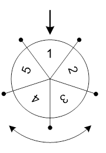

# Занятие 2 (Линейный поиск)

## Classwork

## Homework(до 20.03.24(10 задач))

### task001:

A. Минимальный прямоугольник
Ограничение времени 1 секунда Ограничение памяти 64Mb

Ввод стандартный ввод или input.txt Вывод стандартный вывод или output.txt

На клетчатой плоскости закрашено K клеток. Требуется найти минимальный по площади прямоугольник, со сторонами,
параллельными линиям сетки, покрывающий все закрашенные клетки.

Формат ввода

Во входном файле, на первой строке, находится число K (1 ≤ K ≤ 100). На следующих K строках находятся пары
чисел Xi и Yi — координаты закрашенных клеток (|Xi|, |Yi| ≤ 109).

Формат вывода

Выведите в выходной файл координаты левого нижнего и правого верхнего углов прямоугольника.

Пример
Ввод
4 1 3 3 1 3 5 6 3
Вывод
1 1 6 5

### task002:

B. Продавец рыбы
Ограничение времени 1 секунда Ограничение памяти 64Mb

Ввод стандартный ввод или input.txt Вывод стандартный вывод или output.txt

Вася решил заняться торговлей рыбой. С помощью методов машинного обучения он предсказал цены на рыбу на N дней вперёд.
Он решил, что в один день он купит рыбу, а в один из следующих дней — продаст
(то есть совершит или ровно одну покупку и продажу или вообще не совершит покупок и продаж, если это не принесёт ему
прибыли). К сожалению, рыба — товар скоропортящийся и разница между номером дня продажи и номером дня покупки не
должна превышать K.

Определите, какую максимальную прибыль получит Вася.

Формат ввода

В первой строке входных данных задаются числа N и K (1 ≤ N ≤ 10000, 1 ≤ K ≤ 100).

Во второй строке задаются цены на рыбу в каждый из N дней. Цена — целое число, которое может находится в
пределах от 1 до 109.

Формат вывода

Выведите одно число — максимальную прибыль, которую получит Вася.

Пример 1
Ввод
5 2 1 2 3 4 5
Вывод
2

Пример 2
Ввод
5 2 5 4 3 2 1
Вывод
0

### task003:

C. Петя, Маша и верёвочки
Ограничение времени 1 секунда Ограничение памяти 512Mb

Ввод стандартный ввод или input.txt Вывод стандартный вывод или output.txt

На столе лежали две одинаковые верёвочки целой положительной длины.

Петя разрезал одну из верёвочек на N частей, каждая из которых имеет целую положительную длину, так что на столе
стало N+1 верёвочек. Затем в комнату зашла Маша и взяла одну из лежащих на столе верёвочек. По длинам оставшихся на
столе N верёвочек определите, какую наименьшую длину может иметь верёвочка, взятая Машей.

Формат ввода

Первая строка входных данных содержит одно целое число N — количество верёвочек, оставшихся на столе (2 ≤ N ≤ 1000).
Во второй строке содержится N целых чисел li — длины верёвочек (1 ≤ li ≤ 1000).

Формат вывода

Выведите одно целое число — наименьшую длину, которую может иметь верёвочка, взятая Машей.

Пример 1
Ввод
4 1 5 2 1
Вывод
1

Пример 2
Ввод
4 5 12 4 3
Вывод
24

### task004:

D. Шахматная доска
Ограничение времени 1 секунда Ограничение памяти 64Mb

Ввод стандартный ввод или input.txt Вывод стандартный вывод или output.txt

Из шахматной доски по границам клеток выпилили связную (не распадающуюся на части) фигуру без дыр. Требуется определить
ее периметр.

Формат ввода

Сначала вводится число N (1 ≤ N ≤ 64) – количество выпиленных клеток. В следующих N строках вводятся координаты
выпиленных клеток, разделенные пробелом (номер строки и столбца – числа от 1 до 8). Каждая выпиленная клетка указывается
один раз.

Формат вывода

Выведите одно число – периметр выпиленной фигуры (сторона клетки равна единице).

Пример 1
Ввод
3
1 1
1 2
2 1
Вывод
8
Пример 2
Ввод
1
8 8
Вывод
4

Примечания

Вырезан уголок из трех клеток. Сумма длин его сторон равна 8.

Вырезана одна клетка. Ее периметр равен 4.

### task005:

E. Амбициозная улитка
Ограничение времени 5 секунд Ограничение памяти 256Mb

Ввод стандартный ввод или input.txt Вывод стандартный вывод или output.txt

Домашний питомец мальчика Васи — улитка Петя. Петя обитает на бесконечном в обе стороны вертикальном столбе,
который для удобства можно представить как числовую прямую. Изначально Петя находится в точке 0.

Вася кормит Петю ягодами. У него есть n ягод, каждая в единственном экземпляре. Вася знает, что если утром он даст
Пете ягоду с номером i, то поев и набравшись сил, за остаток дня Петя поднимется на ai единиц вверх по столбу,
но при этом за ночь, потяжелев, съедет на bi единиц вниз. Параметры различных ягод могут совпадать.

Пете стало интересно, а как оно там, наверху, и Вася взялся ему в этом помочь. Ближайшие n дней он будет кормить
Петю ягодами из своего запаса таким образом, чтобы максимальная высота, на которой побывал Петя за эти n дней была
максимальной. К сожалению, Вася не умеет программировать, поэтому он попросил вас о помощи. Найдите, максимальную
высоту, на которой Петя сможет побывать за эти n дней и в каком порядке Вася должен давать Пете ягоды, чтобы Петя
смог её достичь!

Формат ввода В первой строке входных данных дано число n (1≤n≤5⋅105) — количество ягод у Васи. В последующих n строках
описываются параметры каждой ягоды. В i+1 строке дано два числа ai и bi (0≤ai,bi≤109) — то, насколько поднимется
улитка за день после того, как съест i ягоду и насколько опуститься за ночь.

Формат вывода В первой строке выходных данных выведите единственное число — максимальную высоту, которую сможет
достичь Петя, если Вася будет его кормить оптимальным образом. В следующей строке выведите n различных целых
чисел от 1 до n — порядок, в котором Вася должен кормить Петю (i число в строке соответствует номеру ягоды, которую
Вася должен дать Пете в i день чтобы Петя смог достичь максимальной высоты).

Пример 1
Ввод
3
1 5
8 2
4 4
Вывод
10
2 3 1
Пример 2
Ввод
2
7 6
7 4
Вывод
10
2 1

Примечания
Во втором примере изначально улитка находится на высоте 0. Пусть сначала Петя накормит её второй ягодой, а затем
первой. После того как она съест вторую ягоду, за день она поднимется на 7 (и окажется на высоте 7),
а за ночь опустится на 4 (и окажется на высоте 3). После того как она съест первую ягоду, за день она поднимется на
7 (и окажется на высоте 10), а за ночь опустится на 6 (и окажется на высоте 4).
Таким образом, максимальная высота, на которой побывает улитка при данном порядке кормления, равна 10.
Нетрудно видеть, что если Петя накормит улитку сначала первой ягодой, а затем второй, то максимальная высота,
на которой побывает улитка, будет меньше.

### task006:

F. Колесо Фортуны
Ограничение времени 1 секунда Ограничение памяти 64Mb

Ввод стандартный ввод или input.txt Вывод стандартный вывод или output.txt

Развлекательный телеканал транслирует шоу «Колесо Фортуны». В процессе игры участники шоу крутят большое колесо,
разделенное на сектора. В каждом секторе этого колеса записано число. После того как колесо останавливается,
специальная стрелка указывает на один из секторов. Число в этом секторе определяет выигрыш игрока.

Юный участник шоу заметил, что колесо в процессе вращения замедляется из-за того, что стрелка задевает за выступы на
колесе, находящиеся между секторами. Если колесо вращается с угловой скоростью v градусов в секунду, и стрелка,
переходя из сектора X к следующему сектору, задевает за очередной выступ, то текущая угловая скорость движения
колеса уменьшается на k градусов в секунду. При этом если v ≤ k, то колесо не может преодолеть препятствие и
останавливается. Стрелка в этом случае будет указывать на сектор X.

Юный участник шоу собирается вращать колесо. Зная порядок секторов на колесе, он хочет заставить колесо вращаться с
такой начальной скоростью, чтобы после остановки колеса стрелка указала на как можно большее число. Колесо можно
вращать в любом направлении и придавать ему начальную угловую скорость от a до b градусов в секунду.

Требуется написать программу, которая по заданному расположению чисел в секторах, минимальной и максимальной
начальной угловой скорости вращения колеса и величине замедления колеса при переходе через границу секторов
вычисляет максимальный выигрыш.

Формат ввода

Первая строка входного файла содержит целое число n — количество секторов колеса (3 ≤ n ≤ 100).

Вторая строка входного файла содержит n положительных целых чисел, каждое из которых не превышает 1000 — числа,
записанные в секторах колеса. Числа приведены в порядке следования секторов по часовой стрелке.
Изначально стрелка указывает на первое число.

Третья строка содержит три целых числа: a, b и k (1 ≤ a ≤ b ≤ 109, 1 ≤ k ≤ 109).

Формат вывода

В выходном файле должно содержаться одно целое число — максимальный выигрыш.

Пример 1
Ввод
5
1 2 3 4 5
3 5 2
Вывод
5
Пример 2
Ввод
5
1 2 3 4 5
15 15 2
Вывод
4
Пример 3
Ввод
5
5 4 3 2 1
2 5 2
Вывод
5

Примечания

В первом примере возможны следующие варианты: можно придать начальную скорость колесу равную 3 или 4, что приведет к
тому, что стрелка преодолеет одну границу между секторами, или придать начальную скорость равную 5, что позволит стрелке
преодолеть 2 границы между секторами. В первом варианте, если закрутить колесо в одну сторону, то выигрыш получится
равным 2, а если закрутить его в противоположную сторону, то — 5. Во втором варианте, если закрутить колесо в одну
сторону, то выигрыш будет равным 3, а если в другую сторону, то — 4.

Во втором примере возможна только одна начальная скорость вращения колеса — 15 градусов в секунду. В этом случае при
вращении колеса стрелка преодолеет семь границ между секторами. Тогда если его закрутить в одном направлении, то выигрыш
составит 4, а если в противоположном направлении, то — 3.

Наконец, в третьем примере оптимальная начальная скорость вращения колеса равна 2 градусам в секунду. В этом случае
стрелка вообще не сможет преодолеть границу между секторами, и выигрыш будет равен 5.

### task007:

G. Ни больше ни меньше
Ограничение времени 2 секунды Ограничение памяти 256Mb

Ввод стандартный ввод или input.txt Вывод стандартный вывод или output.txt

Дан массив целых положительных чисел a длины n. Разбейте его на минимально возможное количество отрезков,
чтобы каждое число было не меньше длины отрезка которому оно принадлежит. Длиной отрезка считается количество чисел
в нем.

Разбиение массива на отрезки считается корректным, если каждый элемент принадлежит ровно одному отрезку.

Формат ввода

Первая строка содержит одно целое число t (1 ≤ t ≤ 1 000) — количество наборов тестовых данных. Затем следуют
t наборов тестовых данных.

Первая строка набора тестовых данных содержит одно целое число n (1 ≤ n ≤ 105) — длину массива.

Следующая строка содержит n целых чисел a1, a2, …, an (1 ≤ ai ≤ n) — массив a.

Гарантируется, что сумма n по всем наборам тестовых данных не превосходит 2 ⋅ 105.

Формат вывода

Для каждого набора тестовых данных в первой строке выведите число k — количество отрезков в вашем разбиении.

Затем в следующей строке выведите k чисел len1, len2, …, lenk — длины отрезков в порядке слева направо.

Пример
Ввод
3
5
1 3 3 3 2
16
1 9 8 7 6 7 8 9 9 9 9 9 9 9 9 9
7
7 2 3 4 3 2 7
Вывод
3
1 2 2
3
1 6 9
3
2 3 2
Примечания

Ответы в примере соответствуют разбиениям:

{[1], [3, 3], [3, 2]}

{[1], [9, 8, 7, 6, 7, 8], [9, 9, 9, 9, 9, 9, 9, 9, 9]}

{[7, 2], [3, 4, 3], [2, 7]}

В первом наборе тестовых данных набор длин {1, 3, 1}, соответствующий разбиению {[1], [3, 3, 3], [2]}, также был бы
корректным.

### task008:

H. Наилучший запрет
Ограничение времени 3 секунды
Ограничение памяти 256Mb
Ввод стандартный ввод или input.txt
Вывод стандартный вывод или output.txt
Константин и Михаил играют в настольную игру «Ярость Эльфов». В игре есть n рас и m классов персонажей.
Каждый персонаж характеризуется своими расой и классом. Для каждой расы и каждого класса существует ровно один
персонаж такой расы и такого класса. Сила персонажа i-й расы и j-го класса равна ai j, и обоим игрокам это
прекрасно известно.

Сейчас Константин будет выбирать себе персонажа. Перед этим Михаил может запретить одну расу и один класс,
чтобы Константин не мог выбирать персонажей, у которых такая раса или такой класс. Конечно же, Михаил старается,
чтобы Константину достался как можно более слабый персонаж, а Константин, напротив, выбирает персонажа посильнее.
Какие расу и класс следует запретить Михаилу?

Формат ввода
Первая строка содержит два целых числа n и m (2 ≤ n,m ≤ 1000) через пробел — количество рас и классов в игре
«Ярость Эльфов», соответственно.
В следующих n строках содержится по m целых чисел через пробел. j-е число i-й из этих строк — это ai j (1 ≤ ai j ≤ 109).
Формат вывода
В единственной строке выведите два целых числа через пробел — номер расы и номер класса, которые следует запретить
Михаилу. Расы и классы нумеруются с единицы. Если есть несколько возможных ответов, выведите любой из них.

Пример 1
Ввод
2 2
1 2
3 4
Вывод
2 2
Пример 2
Ввод
3 4
1 3 5 7
9 11 2 4
6 8 10 12
Вывод
3 2

### task009:

I. Пираты Баренцева моря
Ограничение времени 1 секунда
Ограничение памяти 64Mb
Ввод стандартный ввод или input.txt
Вывод стандартный вывод или output.txt
Вася играет в настольную игру «Пираты Баренцева моря», которая посвящена морским битвам.
Игровое поле представляет собой квадрат из N×N клеток, на котором расположено N кораблей
(каждый корабль занимает одну клетку).
Вася решил воспользоваться линейной тактикой, для этого ему необходимо выстроить все N
кораблей в одном столбце. За один ход можно передвинуть один корабль в одну из четырёх соседних по стороне клеток.
Номер столбца, в котором будут выстроены корабли, не важен. Определите минимальное количество ходов, необходимых
для построения кораблей в одном столбце. В начале и процессе игры никакие два корабля не могут находиться в
одной клетке.

Формат ввода
В первой строке входных данных задаётся число
N (1≤N≤100).
В каждой из следующих N строк задаются координаты корабля: сначала номер строки, затем номер столбца
(нумерация начинается с единицы).

Формат вывода
Выведите одно число — минимальное количество ходов, необходимое для построения.
Пример
Ввод
3
1 2
3 3
1 1
Вывод
3
Примечания
В примере необходимо выстроить корабли в столбце номер 2. Для этого необходимо переставить корабль из
клетки 3 3 в клетку 3 2 за один ход, а корабль из клетки 1 1 в клетку 2 2 за два хода.
Существуют и другие варианты перестановки кораблей, однако ни в одном из них нет меньше трёх ходов.

### task010:

J. Два прямоугольника
Ограничение времени	1 секунда
Ограничение памяти	64Mb
Ввод	стандартный ввод или input.txt
Вывод	стандартный вывод или output.txt
Недавно один известный художник-абстракционист произвел на свет новый шедевр — картину «Два черных непересекающихся 
прямоугольника». Картина представляет собой прямоугольник m× n, разбитый на квадраты 1× 1, некоторые из которых 
закрашены любимым цветом автора — черным. Федя — не любитель абстрактных картин, однако ему стало интересно, 
действительно ли на картине изображены два непересекающихся прямоугольника. Помогите ему это узнать. 
Прямоугольники не пересекаются в том смысле, что они не имеют общих клеток.

Формат ввода
Первая строка входного файла содержит числа m и n (1 ≤ m, n ≤ 200). Следующие m строк содержат описание рисунка. 
Каждая строка содержит ровно n символов. Символ «.» обозначает пустой квадрат, а символ «#» — закрашенный.

Формат вывода
Если рисунок можно представить как два непересекающихся прямоугольника, выведите в первой строке «YES», а в 
следующих m строках выведите рисунок в том же виде, в каком он задан во входном файле, заменив квадраты, 
соответствующие первому прямоугольнику на символ «a», а второму — на символ «b». Если решений несколько,
выведите любое.

Если же этого сделать нельзя, выведите в выходной файл «NO».

Пример 1
Ввод	
2 1
#
.
Вывод
NO
Пример 2
Ввод	
2 2
..
##
Вывод
YES
..
ab
Пример 3
Ввод	
1 3
###
Вывод
YES
abb
Пример 4
Ввод	
1 5
####.
Вывод
YES
abbb.